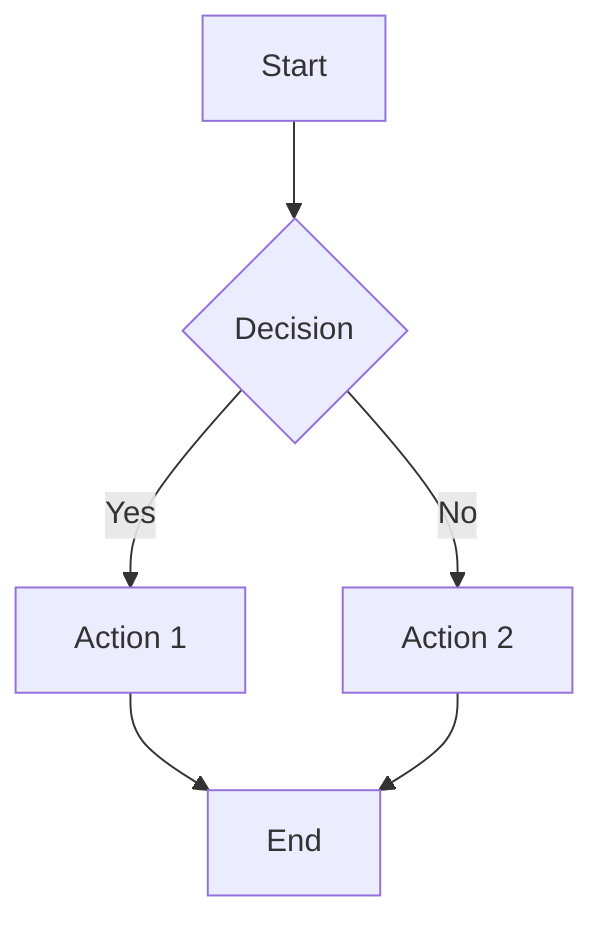
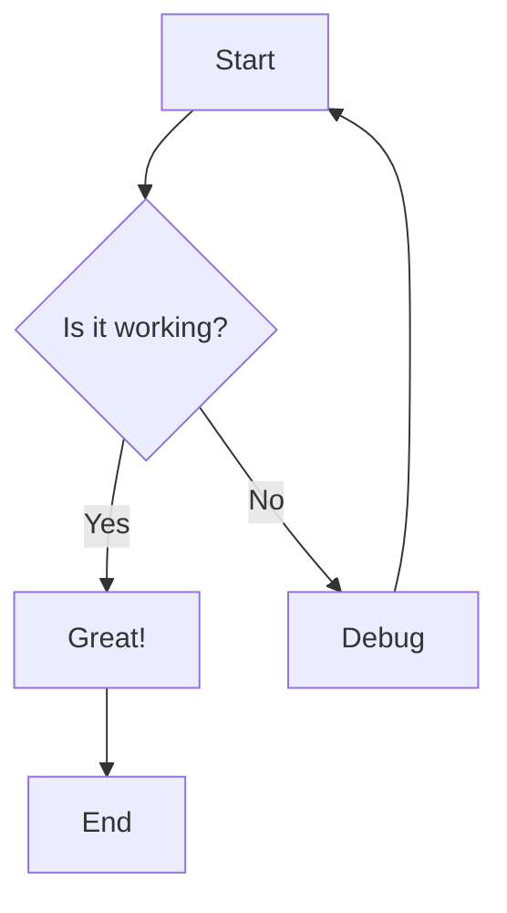
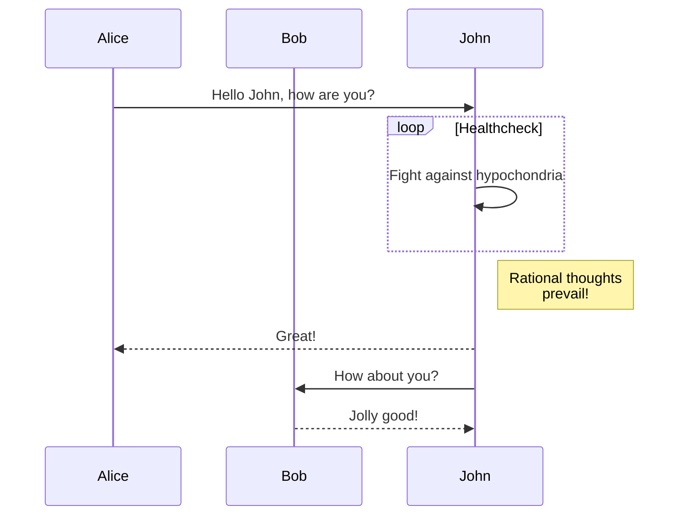
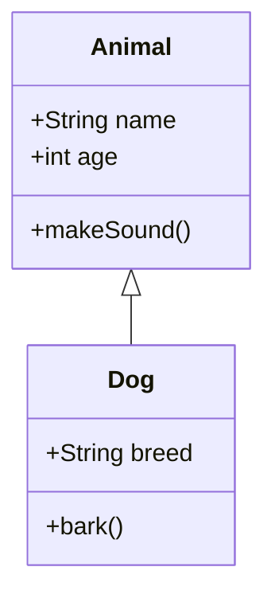
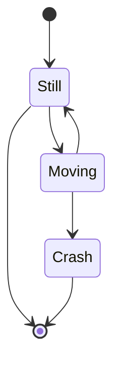
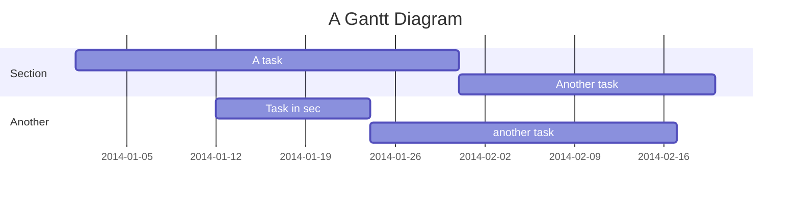

# Mermaid Diagram Rendering in LibreChat

LibreChat now supports rendering Mermaid diagrams directly in chat messages! This feature allows you to create flowcharts, sequence diagrams, and other visual representations using simple text-based syntax.

## How to Use

To render a Mermaid diagram in a chat message, simply wrap your Mermaid code in a code block with the language identifier `mermaid`:

````markdown

````

## Supported Diagram Types

Mermaid supports many diagram types including:

### Flowcharts
````markdown

````

### Sequence Diagrams
````markdown

````

### Class Diagrams
````markdown

````

### State Diagrams
````markdown

````

### Gantt Charts
````markdown

````

## Features

- **Interactive Controls**: Each rendered diagram includes zoom in, zoom out, and reset controls in the top-right corner
- **Dark/Light Mode Support**: Diagrams automatically adapt to your current theme
- **Error Handling**: If a diagram fails to render, an error message is displayed with the option to view the source code
- **Responsive Design**: Diagrams are responsive and scale appropriately for different screen sizes

## Implementation Details

### How It Works

1. When a code block with language `mermaid` is encountered in markdown content, the `MermaidRenderer` component is used instead of the regular code block
2. The `MermaidRenderer` component uses the official Mermaid library to parse and render the diagram
3. The component automatically detects the current theme (light/dark) and applies appropriate styling
4. Interactive controls are provided for better user experience

### Files Modified

- `client/src/components/Chat/Messages/Content/MermaidRenderer.tsx` - New component for rendering Mermaid diagrams
- `client/src/components/Chat/Messages/Content/Markdown.tsx` - Modified to detect and handle Mermaid code blocks
- `client/src/components/Chat/Messages/Content/MarkdownLite.tsx` - Uses the same code components, so inherits Mermaid support
- `client/package.json` - Added `mermaid` and `react-zoom-pan-pinch` dependencies

### Dependencies Added

- `mermaid` - The official Mermaid library for diagram generation
- `react-zoom-pan-pinch` - For zoom and pan controls on diagrams

## Examples in Action

When you send a message containing Mermaid syntax in a code block, it will automatically be rendered as an interactive diagram instead of plain text. The diagram will:

1. Render with appropriate colors for the current theme
2. Be contained within a bordered container
3. Include zoom controls in the top-right corner
4. Show error information if the syntax is invalid
5. Scale appropriately for the chat interface

## Tips for Best Results

1. **Valid Syntax**: Ensure your Mermaid syntax is valid. Invalid syntax will show an error message
2. **Diagram Size**: Keep diagrams reasonably sized for chat display. Very large diagrams may need zooming
3. **Theme Consistency**: Diagrams will automatically match your current light/dark theme preference
4. **Interactive Elements**: Use the zoom controls for better viewing of complex diagrams

This enhancement makes LibreChat more powerful for technical discussions, documentation, and visual communication!
